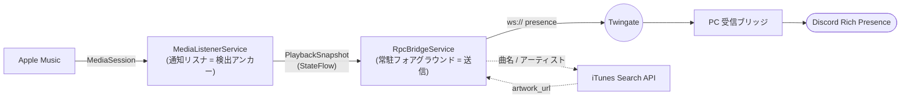

<div align="center">

# 🎵 AppleMusic RPC

**Android の Apple Music 再生状況を Discord Rich Presence に流す送信側クライアント**

[](https://www.android.com/)
[](app/build.gradle.kts)
[](https://kotlinlang.org/)
[](https://developer.android.com/jetpack/compose)
[](#-ライセンス)
[](https://github.com/warasugitewara/Waras-AppleMusic-RPC/releases/latest)

</div>

---

受信側は別リポジトリ [`warasugitewara/Waras-discordRPC`](https://github.com/warasugitewara/Waras-discordRPC)(PC 上で動く WebSocket 受信ブリッジ)。
両者の通信は PC 側リポジトリの `docs/PROTOCOL.md`(契約バージョン 1)に準拠する。

> **📥 ダウンロード**: ビルド済み APK は [最新リリース](https://github.com/warasugitewara/Waras-AppleMusic-RPC/releases/latest) から取得できます。

## ✨ 特長

- 🔍 **自動検出** — `NotificationListenerService` をアンカーに Apple Music のメディアセッションを監視
- 🔗 **常駐ブリッジ** — フォアグラウンドサービスが WebSocket で再生中だけ presence を送信
- 🖼️ **アートワーク解決** — iTunes Search API で曲名/アーティストから高解像度の画像 URL を取得(OFF 可)
- ⏱️ **進捗バー対応** — `position_ms` / `duration_ms` を送り、PC 側で経過バー化(一時停止も反映)
- 🔒 **プライベート経路** — Twingate オーバーレイ内の平文 `ws://` 前提(ポート開放不要)
- 🌑 **ダーク UI** — Jetpack Compose (Material3) によるダーク固定の設定画面

## 🏗️ アーキテクチャ

同一プロセス内の 2 つのサービスが核。状態は Binder/IPC を使わずプロセス内シングルトン(`StateFlow`)で受け渡す。



| レイヤ | 役割 |
|---|---|
| `service` | `MediaListenerService`(検出)/ `RpcBridgeService`(送信・keepalive・停止判断) |
| `net` | `BridgeClient`(OkHttp WS・Bearer 認証・再接続)/ `PresenceBuilder`(PROTOCOL v1 JSON)/ `ArtworkResolver`(iTunes) |
| `data` | `Settings`(SharedPreferences)/ `PlaybackSnapshot`(位置外挿・曲変更判定)/ 状態ホルダ |
| `ui` | `MainActivity` + Jetpack Compose(設定入力・権限導線のみ) |

### PC 側との対応(PROTOCOL v1)

- **進捗バー**は PC 側が計算する。クライアントは `position_ms` / `duration_ms` を送るだけ(`start = now - position_ms`)。
- **TTL 維持**: PC 側ソース TTL は既定 30 秒。無音で失効するので **20 秒ごと(設定可)に現在位置入りで再送**して更新する。
- **再接続**: WS 切断で PC 側はソースを失効させるため、`ready` 受信時に現在状態を再送する。
- **停止**: 再生終了後、猶予(既定 45 秒)経過で `op:"clear"` を送りサービスを止める。
- **認証**: ハンドシェイクの HTTP ヘッダ `Authorization: Bearer <token>`。不一致は PC 側が `close(4001)`。

## 📋 前提

<table>
<tr><th>PC 側(受信ブリッジ)</th><th>Android 側</th></tr>
<tr><td valign="top">

1. `Waras-discordRPC` が起動済み(`python app.py` か配布 exe)
2. `config.json` の `network_mode` を `twingate`、`bind` を到達可能な IP(または `0.0.0.0`)、`port` 既定 `13520`
3. `.env` の `BRIDGE_TOKEN` を設定(アプリ側と同値)
4. Discord デスクトップ起動 + `DISCORD_CLIENT_ID` 設定済み
5. ソース `phone-music` を有効化

</td><td valign="top">

- JDK 17+(Android Studio 同梱の JBR で可)
- 端末で **Twingate** が接続済みで PC リソースに到達可能
- 端末で Apple Music が動作
- 通知アクセス権限(必須)

</td></tr>
</table>

## 🔨 ビルド & インストール

Gradle wrapper はコミット済みなので追加生成は不要。

```bash
git clone https://github.com/warasugitewara/Waras-AppleMusic-RPC
cd Waras-AppleMusic-RPC
./gradlew assembleDebug
adb install -r app/build/outputs/apk/debug/app-debug.apk
```

- Android Studio で開いて Sync → 実機を USB 接続して Run でも可。
- 要件: JDK 17 / Gradle 8.9 / AGP 8.7.3 / Kotlin 2.0.21、`compileSdk = targetSdk = 35`、`minSdk = 26`。
- `applicationId` は `com.warasugi.amrpc`(`app/build.gradle.kts` で変更可)。

## ⚙️ 設定 & 権限付与

アプリを起動して上から順に:

1. **接続設定** — ホスト(PC の Twingate IP / Resource DNS)、ポート(`13520`)、`BRIDGE_TOKEN`(PC 側 `.env` と同値)
2. **ソース** — `source_id` は `phone-music`(PC 側と一致させる)
3. **権限**(必須順)
   1. **通知アクセス**(必須) — これが無いとメディアセッションを取得できない
   2. **通知の表示**(Android 13+) — 常駐通知のため
   3. **電池最適化から除外**(実質必須) — Android 12 以降、バックグラウンドからの FGS 起動は除外が exemption。許可しないと再生開始時の自動起動が弾かれることがある
4. **「保存」→「接続/再接続」**

## ▶️ 使い方

- Apple Music で再生 → 数秒で Discord に表示(アートワークは URL 取得後に少し遅れて反映)
- 一時停止 → `Paused`(タイムスタンプが外れる)
- 停止 / アプリを閉じる → 猶予後に表示が消える
- アプリ内「停止」で常駐を止められる。再生を再開すると(通知アクセスが有効なら)再び起動

## ⚠️ 制約・注意点

- **iTunes Search API は唯一の外部通信**。曲名・アーティストが Apple のサーバに送られる(Twingate 非経由)。気になる場合はアートワークを OFF にできる(画像なしで動作)。
- **TTL とキープアライブ**: 長い曲でも 20 秒ごとに再送。PC 側 `min_update_interval` は 15 秒なので Discord 反映はそれ以上の間隔に合体される(仕様どおり)。
- **フォアグラウンドサービス種別は `specialUse`**。用途(自ホストの Discord ブリッジへ再生メタデータを中継)を manifest に宣言済み。`mediaPlayback` は実際に再生しないため不使用。
- **Twingate 必須**。平文 `ws://` は Twingate オーバーレイ内前提(PROTOCOL のとおりアプリ層 TLS なし)。
- **対象パッケージは可変**。既定 `com.apple.android.music`。端末で実パッケージ名が違う場合は設定のカンマ区切りで変更可。

## 🛠️ トラブルシュート

| 症状 | 確認 |
|---|---|
| `認証失敗` と出る / すぐ切れる | `BRIDGE_TOKEN` が PC 側と一致しているか。不一致だと `close(4001)`。 |
| 何も表示されない | PC 側で `phone-music` が有効・優先度が適切か。`GET /health` で `active_source` を確認。 |
| 接続できない | 端末の Twingate が接続済みか。ホスト/ポートが正しいか。PC の `bind` が到達可能か。 |
| 再生開始で自動起動しない | アプリを開いて「電池最適化から除外」を許可(Android 12+ の exemption)。 |
| 曲の途中で消える | キープアライブが届いていない可能性。電池最適化除外と通知アクセスを確認。 |
| アートワークが出ない | iTunes 検索がヒットしていないか、アートワークが OFF。ストアフロント(国)を確認。 |

## 📄 ライセンス

MIT. © 2026 .warasugi
